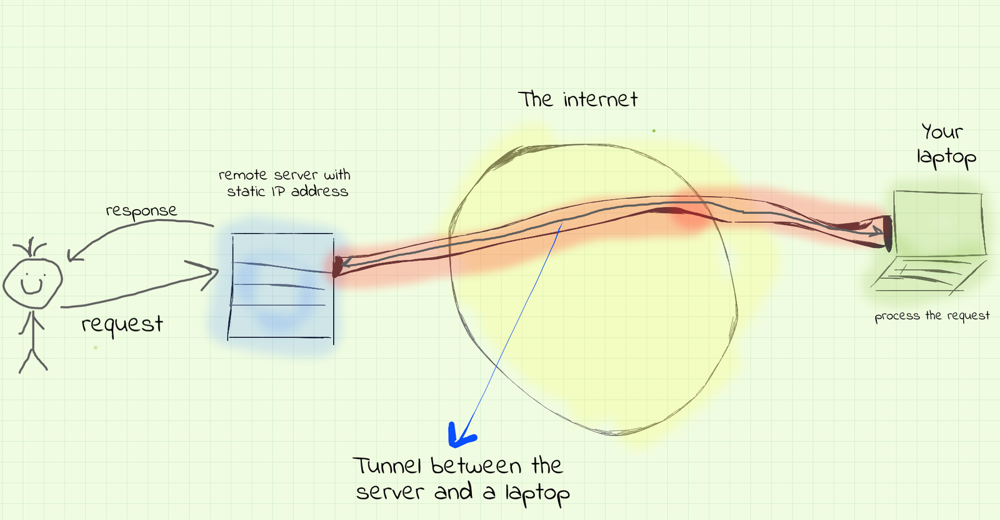
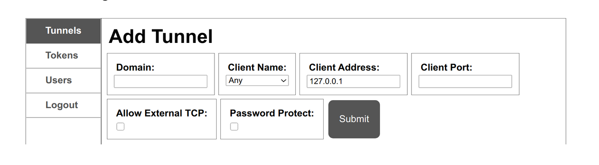

Title: How to expose your localhost to the internet 🏠
Date: 2022-02-13
Author: Mohanad Kaleia
Category: Howto
Tags: proxy, localhost, webserver, tunneling
Slug: how-to-expose-your-localhost-to-the-internet
Status: published
Cover: 


# Introduction 
In order to expose a web server to the internet, so users can access it from anywhere, you will need few things. 1) A web server 2) Static IP address 3) maybe a domain name. If you are reading this blog from a laptop then you already have the first requirement, really even a raspberry pi can be used as web server. 
Having a domain name is also not a big deal, on average for $10 you can get a decent domain name. 
The main issue with exposing a web server to the internet is really having a static IP address. The IP address we get assigned by our internet service provider is not static and usually gets changed every once and while. Getting a static IP address is not always an option depending on your ISP, and sometimes it can be very expensive. 

That is why usually we use a cloud services provider like AWS or other hosting services to host our web services or our websites. Depending on the specs required to run our web service, the cost of renting a server in the cloud could be a bit pricey. 
In this blog, I will walk you through how to host and expose your web services locally using ssh tunneling tool called [Boringproxy](https://boringproxy.io).


# How it works?
Lets first take a look at the following diagram. This really a representation of how to expose your local laptop to the internet in a way to allow users to access it.



Here is the sequence, 

1. A remote server with a static IP address lets say hosted on AWS or in Heruko
2. Your laptop as a web server hosting content you want to expose
3. Tunnel in between the server and your local laptop 
4. All requests to your website, will be received by the remote server, 
5. redirected to the your local laptop through the tunnel 
6. the local laptop will process the request, 
7. then it returns the response back through the tunnel to the remote server 
8. which then delivered back to the user 


All components sounds familiar, but what **tunneling** is? How can we open a tunnel between two computers? 

Regardless of the tool we are going to use to expose our localhost, it is very important to understand the what is happening under the hood. In order to expose a bi-directional communication is opened between two computers (in our case the local laptop and the remote server). This bi-directional tunnel can be opened using HTTP method called [Connect](https://developer.mozilla.org/en-US/docs/Web/HTTP/Methods/CONNECT). After the tunnel is initiated, TCP packets can be transmitted in between 

If you want to learn more about tunneling please refer to this [resource](https://developer.mozilla.org/en-US/docs/Web/HTTP/Proxy_servers_and_tunneling) or maybe just simply Google it. 

# Boringproxy
In the past few months, I explored different solutions for `http-tunneling`. I found few neat ones, for example tried [ngrok](https://ngrok.com/) and [frp](https://github.com/fatedier/frp). Though I found [boringproxy](https://boringproxy.io/) as the best solution to me for the following reasons: 

1. Free 
2. Opensource 
3. stupid simple
4. Their mission is f*&king amazing!!! 
5. Built in Go
6. Well maintained

In this section I will briefly explain how to setup boringproxy to expose a local machine (I used raspberry pi) to serve a simple website. My blog you are reading this post from is hosted on my local raspberry pi 🙂 

Lets hear how boringproxy describes itself: 
> `boringproxy` is a combination of a reverse proxy and a tunnel manager.
> What that means is if you have a self-hosted web service (Nextcloud, Emby, Jellyfin, etherpad, personal website, etc.) running on a private network (such as behind a NAT at home), boringproxy aims to provide the easiest way to securely (i.e. HTTPS and optional password-protection) expose that server to the internet, so you can access it from anywhere.

To start using it, you should install boringproxy on both your remote server (lets call it the proxy server) and on your local machine (the machine you are intending to expose). 

## Installation
To install it follow the installation guide [here](https://boringproxy.io/installation/) make sure to choose the right architecture, for example in my case since I was using Raspberry pi I had to pick the ARM architecture. 

(Note I won’t include the command used for installation, since things can get outdated on my blog post, so I will just post links back to the boringproxy official documentations)

## Usage
— please refer to the official [documentation](https://boringproxy.io/usage/). In this section I will just explain the process. 

Lets start by setting up the proxy server (the one in my case on AWS). You only need to actually run the binary you downloaded, like this:

```
./boringproxy-linux-x86_64 server -admin-domain bp.kaleia.io 
```
This is just an example, of course you will need to change it based on the domain name you have. the `bp.kaleia.io` will be used to access `boringproxy` admin page. 
Executing the above command, should print a token to be used when authorizing the access to the admin page. It is also stored in ``boringproxy_db.json` which should be located right next to the downloaded binary.

Similarly,  run boring proxy on you local machine, by doing something like this:
```
./boringproxy client \
    -server <server> -user <user> -token <token> -client-name <client-name>
```

`-server` - the domain of the remote server
`-user` - username, min. six characters, if not admin
`-token` - access token to authenticate against the service
`-client-name` - identifier for the client, used in the interface to distinguish the available tunnel origins

Hopefully, everything is working so far for you, if not I recommend watching some memes and some other funny Youtube videos till the problem fixes itself 😆

Now, we have boringproxy running on both the server and the client. We need to configure the server to redirect all requests coming on our domain to be served by the client (the local server). This can be done by navigating to the boringproxy admin page, in my case it is bp.kaleia.io. 



Isn't neat interface 🤩.. anyway, add the domain name you want your proxyserver to serve, for example, in my case it is `mohanad.kaleia.io` choose the client name you just entered when you setup the client. Leave the client address to localhost and set whatever port number you are using in your client (for example I’m serving my website throughout port 5000). That’s it, hit submit and you should be done! 


Now try to navigate to the domain you entered, if it did not work, then you must have made something incorrect. If it works, then yay! congratulations!! (it took me few tries to fully setup my server and client so don’t feel bad if it did not work from the first time)

# Conclusion
By the end it depends on the type of applications you are hosting and exposing. For example, if you want something low latency, or with high-availability, then local hosting might not be the best option. But, for hosting personal websites, or services for testing, then local hosting with tunneling might be amazing solution to cut on expenses. 

Hopefully this post was helpful or inspiring to other people, if you have troubles or if you need help please feel free to reach me out or dm me. 